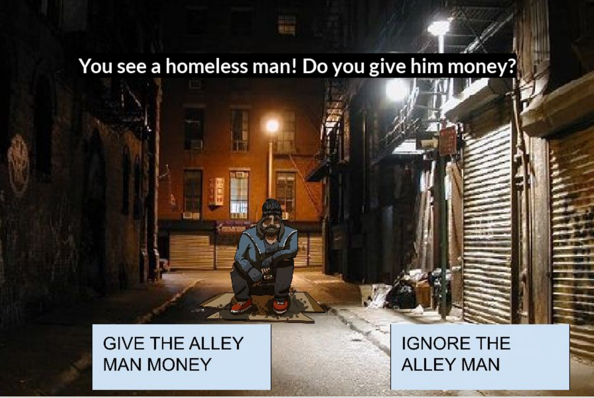
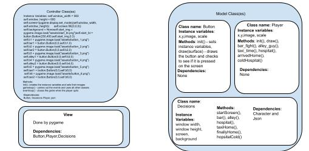

:warning: Everything between << >> needs to be replaced (remove << >> after replacing)
# CS110 Project Proposal
<<<<<<< HEAD
# Final Project
## CS 110 Final Project
### Fall, 2021
=======
# << Final Project >>
## CS 110 Final Project
### << Fall, 2021 >>
>>>>>>> 6e791181b31cc230b81960f8f0ba399d36f07f69
### [Assignment Description](https://docs.google.com/document/d/1H4R6yLL7som1lglyXWZ04RvTp_RvRFCCBn6sqv-82ps/edit#)

<< [https://github.com/bucs110a0fall21/final-project-coding-connoisseurs.git](#) >>

<< [https://docs.google.com/presentation/d/1ITYK472sU1KKtN6VeJiYfvRO0gfVS_N9jdgJbk3mNJo/edit#slide=id.g1069d7b2fee_0_110](#) >>

<<<<<<< HEAD
### Team: Coding Connoisseurs
#### Matthew Kagan, Spencer Mines
=======
### Team: << Coding Connoisseurs >>
#### << Matthew Kagan, Spencer Mines >>
>>>>>>> 6e791181b31cc230b81960f8f0ba399d36f07f69

***

## Project Description *(Software Lead)*
 This project is a choose your own adventure game based in New York City where there are clickable GUI buttons and choices that will either progress you in the game or cause you to lose.

***    

## User Interface Design *(Front End Specialist)*

    * 
    - Start menu which has a GUI button to initiate the game

    * 
    - The first loacation of the adventure game which has 2 buttons that lead to different places

    * 
    - The second location of the game. If the right button was chosen in the bar, you end up in the alley with 2 more options

    * 
    - The last options in the game are on this screen, if chosen right you will win

***        

## Program Design *(Backend Specialist)*
* Non-Standard libraries
    * Pygame
    * For each additional module you should include
        * https://www.pygame.org/docs/
        * This module is used to create the screen and game
* Class Interface Design
    * 
    * This does not need to be overly detailed, but should show how your code fits into the Model/View/Controller paradigm.
* Classes
    * Contoller class - sets the instance variables for the game and carries out the process of loading all the GUI and image components onto the screen
      Button class - provides a GUI button that we use to change the scenes as the game progresses
      Player class - provides the captioning and player image for each screen as the game goes on with the font
      Decisions class - provides the background and music for each screen as the player picks their choice

## Project Structure *(Software Lead)*

The Project is broken down into the following file structure:
* main.py
* src
    * button.py
    * Decisions.py
    * controller.py
    * character.py
* assets
    * Diagram.jpg
    * alleyway.jpg
    * button_1.png
    * back.png
    * button_2.png
    * button_3.png
    * button_4.png
    * button_5.png
    * button_6.png
    * bar.jpg
    * bar_music.wav
    * city.wav
    * doctor.png
    * Fancy.ttf
    * class_diagram.jpg
    * Frank_Sinatra.wav
    * homeless guy.png
    * home.wav
    * honking.wav
    * hospital.png
    * hospital.wav
    * house.png
    * kids.png
    * Lato-Bold.ttf
    * start_bt.png
    * startscreen.jpg
    * taxidriver.png
    * taxi.jpg
    * taxi.wav
    * startimage.png
    * barimage.png
    * alleyimage.png
    * taxiimage.png
   
* etc
    * foldercontents.txt
    * 
***

## Tasks and Responsibilities *(Software Lead)*
* You must outline the team member roles and who was responsible for each class/method, both individual and collaborative.

### Software Lead - Matthew Kagan & Spencer Mines

Shared the responsiblity of integrating the GUI button into the controller class and making sure the classes all aligned and worked properly when imported into another python file. 

### Front End Specialist - Spencer Mines

Created the controller class, set up the starting screen and captions and worked with the backend in helping integrate other classes into the controller.

### Back End Specialist - Matthew Kagan

Created the button, decisions and player class and the methods inside of them, as well as worked with the front end in order to incorporate afformentioned classes into the game loop.

## Testing *(Software Lead)*
* Trial and error testing strategy. We ran the code everytime a new feature was added and made sure it worked properly and the game was how we wanted it. 
    * When adding the button feature, we used trial and error in order to make sure the button on screen can only be activated (clicked) once and no longer be in use after.

* Your ATP

| Step                  | Procedure     | Expected Results  | Actual Results |
| ----------------------|:-------------:| -----------------:| -------------- |
|  1  | Open terminal, navigate to folder and type "python3 main.py"  | program starts and siaplsy start screen with start button  | program starts and siaplsy start screen with start button         |
|  2  | Press the start button to intiate the game  | the bar scene loads onto screen with 2 more options for the user to choose between |  the bar scene loads onto screen with 2 more options for the user to choose between               |
|  3  | Choose an option to continue from the bar scene  | Based on the option chosen from the GUI buttons, the game will either continue and load the alley scene or you will end up in the hospital and lose  |  Based on the option chosen from the GUI buttons, the game will either continue and load the alley scene or you will end up in the hospital and lose        |
|  4  | Choose an option to continue from the alley scene  | Based on the option chosen from the GUI buttons, the game will either continue and load the taxi scene or you will end up in the hospital and lose  | Based on the option chosen from the GUI buttons, the game will either continue and load the taxi scene or you will end up in the hospital and lose                 |
|  5  | Choose an option to continue from the taxi scene  | Based on the option chosen from the GUI buttons, the game will either continue and load the victory scene or you will end up in the hospital and lose  | Based on the option chosen from the GUI buttons, the game will either continue and load the victory scene or you will end up in the hospital and lose          |

